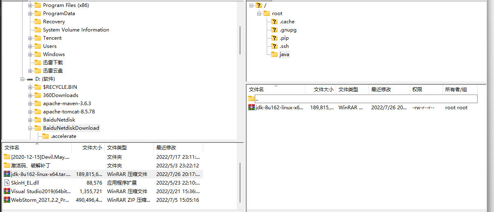

# Vue环境搭建

```sudo apt update  

sudo apt-get update  

sudo apt-get install nodejs  

sudo apt-get install npm  

sudo npm config set registry http://registry.npm.taobao.org 设置国内资源镜像  

sudo npm install npm -g  
sudo npm install -g cnpm --registry=http://registry.npm.taobao.org  

sudo cnpm install vue -g  

sudo cnpm install @vue/cli -g  

sudo cnpm install webpack -g 
```
