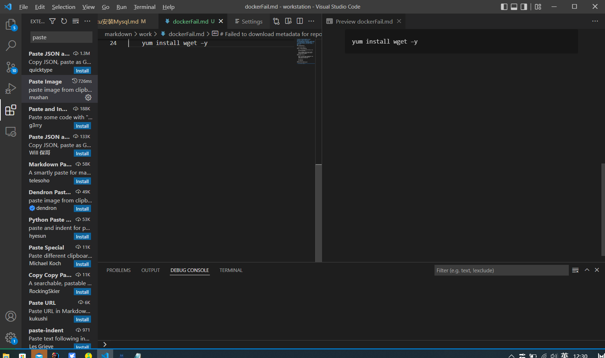

# Failed to download metadata for repo 'appstream': Cannot prepare internal mirrorlist: No URLs in mirrorlist
### 大家都知道Centos8于2021年年底停止了服务，大家再在使用yum源安装时候，出现下面错误“错误：Failed to download metadata for repo ‘AppStream’: Cannot prepare internal mirrorlist: No URLs in mirrorlist”
###
1、进入yum的repos目录
    
    cd /etc/yum.repos.d/
复制
2、修改所有的CentOS文件内容
    
    sed -i 's/mirrorlist/#mirrorlist/g' /etc/yum.repos.d/CentOS-*

    sed -i 's|#baseurl=http://mirror.centos.org|baseurl=http://vault.centos.org|g' /etc/yum.repos.d/CentOS-*
复制
3、更新yum源为阿里镜像

    wget -O /etc/yum.repos.d/CentOS-Base.repo https://mirrors.aliyun.com/repo/Centos-vault-8.5.2111.repo
 
    yum clean all

    yum makecache
复制
4、yum安装测试是否可以yum安装

    yum install wget –y

